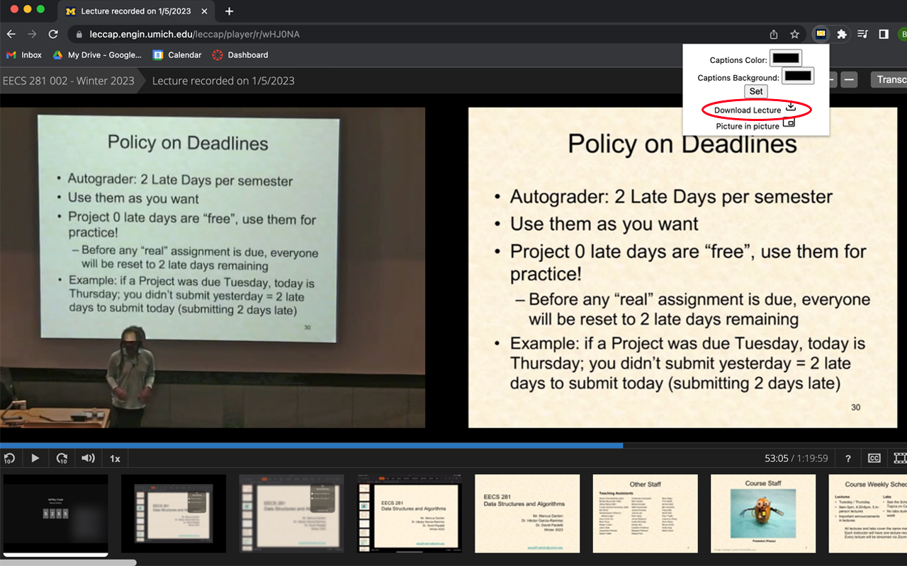
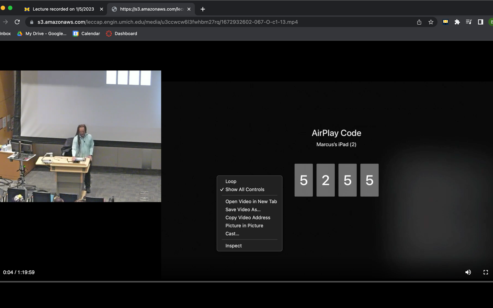
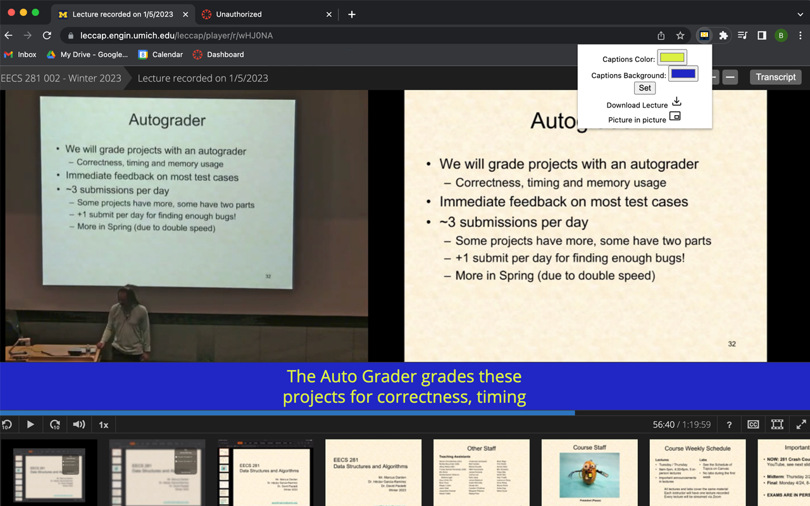
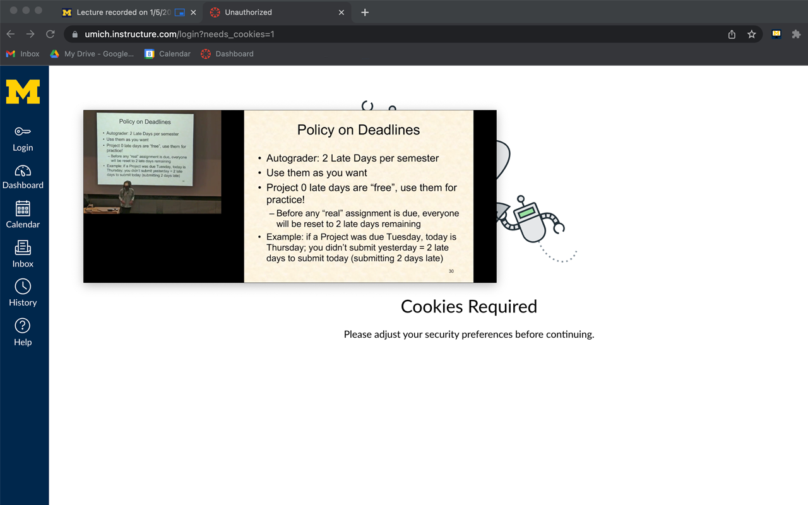

# umich\_lecture\_tools
 Adding functionality to Umich lecture recordings through a Chrome extension. You can add it to Chrome here.
 
**NOTE: THIS EXTENSION WILL ONLY WORK WITH URLS THAT FOLLOW https://leccap.engin.umich.edu/leccap/player/r/[SOME_ID]**
 
 I spent the weekend writing this Chrome extension to learn a bit about how the Chrome API works. The interface is super ugly because I didn't have the time to spend designing something then battling CSS. The features are listed below as well as some of the know issues and features that I plan on adding. If you would like to contribute for whatever reason, feel free to issue a pull request or send me an email at my umich email which you can lookup online.
 
## Features

### Lecture Download
Clicking "Lecture Download" will not actually download the lecture. It will instead open the raw video file in a new tab as seen below. You can then right click "Save Video As", or the Windows equivalent to save the video locally. The video contains both the lecture slides and video stream in a single file.
 

Click "Download Lecture"

Video opens in new tab where you can save it locally

### Picture in Picture
Picture in Picture allows you to watch the lecture video overtop any other content on your screen in a resizable hovering window. The floating window also offers play/pause control.
 

Click "Picture in picture"

Floating window appears over all other content on screen

### Closed Caption Modifications
This feature is still very early in development, so it can only change the text and background color of the closed captions. There are plans to also allow you to change font size and eventually have a movable captions box, but that is not in the current version. The color picker boxes will not save their past states; I will hopefully fix this in the future.

Select your preferred colors with the color pickers and then click "Set"

## Known Issues
* Color pickers not saving past state
* Disgusting UI design
* Basically no error handling code
* Might not work on non-engineering lectures. I'll have to wait until my first ECON lecture to figure this out
* Tons of missing features

## Privacy Policy
Chrome web store is making me have one, so [heres a link](./privacy.md) to it if you want to read it. I don't send any data to anywhere. The extension does inject scripts into webpages that match the URL scheme of a Umich leacture to make the extension work. It also reads the URL of your active tab if you click to open the extension popup, but it only uses that information to disable all features if you're not currently watching a lecture.
